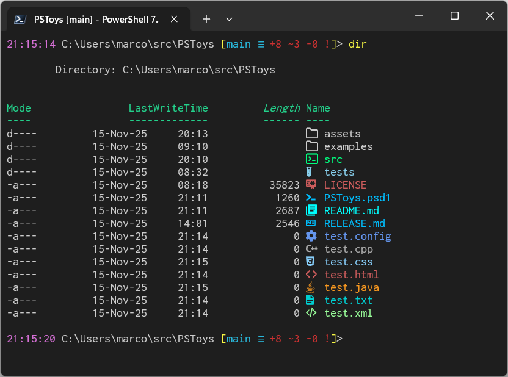

# PowerShell Toys

**PSToys** is a lightweight PowerShell module providing convenient **utilities**:

- Drive space & recycle bin size (`Get-Drives`)
- Local user profile sizing (`Get-Users`)
- Restarting Windows Explorer (`Restart-Explorer`)
- Colored, case-insensitive text search wrapper (`findstr`)
- Disabling or cleaning persistent command history (`Disable-History`, `Remove-KeywordFromHistory`, `Remove-DuplicateHistory`)

**prompt behavior** enhancements:

- Duplicate history pruning
- Ctrl+D exit shortcut
- Command history filter (ignores short and space-/semicolon-prefixed commands)

and **prompt cosmetic** enhancements:

- Date/time prefix
- Inline Git repository status branch, ahead/behind, dirty state (via [posh-git](https://github.com/dahlbyk/posh-git))
- Rich file & directory icons (via [Terminal-Icons](https://github.com/devblackops/Terminal-Icons)):

   Screenshot:
   

## Prerequisites

- One of the fonts provided by [Nerd Fonts](https://www.nerdfonts.com/font-downloads) as they include the glyphs/icons that are referenced from `posh-git` and `Terminal-Icons`.

## Installation

1. 
   ```powershell
   Install-Module PSToys -Scope CurrentUser
   ```

   If prompted about an untrusted repository the first time:

   ```powershell
   Set-PSRepository -Name PSGallery -InstallationPolicy Trusted
   ```

   Or supply `-TrustRepository` on the `Install-Module` command.

   PowerShell 7 note: use `-Scope AllUsers` (with elevated session) if you want it available to all accounts.

1. Enable auto-import on startup by running:
 
   ```powershell
    @('','Import-Module PSToys') >> $PROFILE
    ```

### Verify Installation

```powershell
Get-Module PSToys -ListAvailable | Select Name,Version,Path
Get-Command -Module PSToys
```

If a function does not appear, ensure `FunctionsToExport` in `PSToys.psd1` lists it and re-import with `-Force`.

## Updating

```powershell
Update-Module PSToys
Import-Module PSToys -Force
```

## Usage Examples

```powershell
Get-Drives
Get-Users
Restart-Explorer
findstr keyword *.log
cat file.txt | findstr keyword
Disable-History
Remove-KeywordFromHistory secret
Remove-DuplicateHistory
```

## Contributing

Pull requests with bug fixes and features are very welcome! Open an issue to report bugs or suggest enhancements.

Maintainers only: see `RELEASE.md` for versioning and publishing steps.

## License

See [LICENSE](LICENSE).
